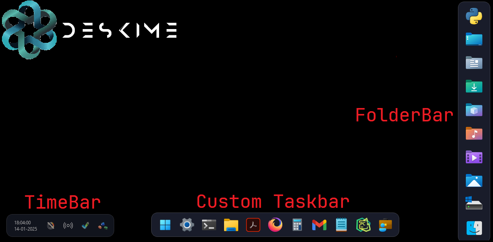

# Deskime Custom Taskbar
<div style="text-align: center;"> 



A custom-built Taskbar, TimeBar and FolderBar just for you written in with Python.
</div>

------------

## Features

-  **Docked Search Bar**: Located at the bottom of the screen, it allows users to open default apps.
  <br><br>
-  **Persistent Time and Quick Access bar**: This bar is located at the bottom left of the screen and stays on top of all apps for quick access
  <br><br>
-  **Folder Dock**: This widget remains hidden until hovered upon on the bottom right of the screen, which triggers it to slide upwards and lets you open your pinned folders
  <br><br>
-  **Custom Start Menu**: Users can create a Custom Start Menu with the apps that can be launched from the custom taskbar
  <br><br>
- **Always on top**: The taskbar and the folder dock are always available and open when the mouse hovers on the bottom middle and right of the screen respectively.
  <br><br>
- **Customizability**: All the apps, icons, features and looks can be customized by the user by editing the .json or the .pyw files.

### Tested On

- **Python Version**: Python 3.10 (64-bit)

### Prerequisites

- [x] Python 3.8 or higher
- [x] Pythonw (typically installed with Python, used for console-less execution)
- [x] pip
- [x] Windows 10 or higher (currently not supported on Mac)

## Setup

1. ⭐ `Clone` this repository branch
	
2.  Install the necessary dependencies mentioned in the main branch of this repository.

3. Customize the app as shown below

4. Run `folders.pyw`, `taskbar.pyw` and `time.pyw`

### Customizing the App

- Edit the Taskbar_Items.json or the Start_Items.json files to change the apps available

```bash
    "Python": {
		"icon": "./icons/ico/py.png",
		"type": "open_app",
		"exec": "C:\\AppDirectory\\python.exe"
	},
```

Replace `AppDirectory` and `AppName` to your desired app. Also, you can change the icons or the type, from `open_app` to `open_url` to open an url. Check the **Taskbar_Items.json** for Gmail url redirect.
<br><br>
Also, remember to **EDIT** the `Start_Items.json` file before running the python file, since it may not run without replacing `YOURAPP LOCATION` in the code.

> [!TIP]
> Adding custom icons will make it look even better!

- Edit the Folders.json files to change the folders available

```bash
    "Desktop": {
		"icon": "./icons/ico/Desktop.ico",
		"type": "open_app",
		"exec": "explorer.exe C:\\Users\\<<USER>>\\Desktop"
	},
```

Replace `<<USER>>` to your folder location

**BEFORE STARTING THE APP, MAKE SURE THAT `<<USER>>` IS REPLACES TO YOUR USERPROFILE IN ALL THE .JSON FILES**

### Support Us
If you appreciate our initiative, consider buying us a coffee to help keep this program open-source and accessible to more users.
<br><br>